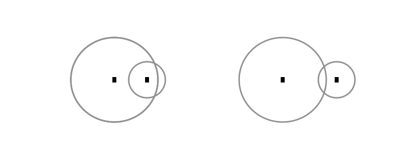

### [Source code](./터렛.py)

---

### 풀이 방법

- 간단한 수학 문제이다. 두 원의 접점 개수를 구하는 문제.

---

### 풀이 중 마주친 issue

- 뇌 빼고 생각해서 두 원이 있을 때, 접점이 생기는 케이스 중 1 개를 빼고 생각했다.

---

### issue 해결 과정

- 다시 고려해 구현했다.
- 두 원이 존재할 때, 크게 고려해야 할 케이스는 3 가지 이다.

    -   1. 두 원이 같은 위치에 존재하는가?
    -   2. 두 원간 접점이 원의 중심점 사이에 존재하는가?
    -   3. 접점이 중심점 바깥에 존재하는가?

- 이 중 3 번째 케이스를 빼먹었었다.

- 왼쪽 그림이 case 2, 오른쪽 그림이 case 3

<p align="center">
    
</p>

-   원의 중심점간 거리와 각 원의 반지름 크기에 대해 잘 생각해서 구현하면 된다.


---

### 추후 개선 사항

- 더 간추려 코드를 작성할 수 있는 듯 하다.

```python
import math

a = int(input())

for _ in range(a) :
    x1, y1, r1, x2, y2, r2 = map(int, input().split())
    distance = math.sqrt((x1-x2)**2 + (y1-y2)**2)
    if distance == 0 and r1 == r2 :
        print(-1)
    elif abs(r1-r2) == distance or r1+r2  ==distance :
        print(1)
    elif abs(r1-r2) <distance < abs(r1+r2) :
        print(2)
    else :
        print(0)
```

